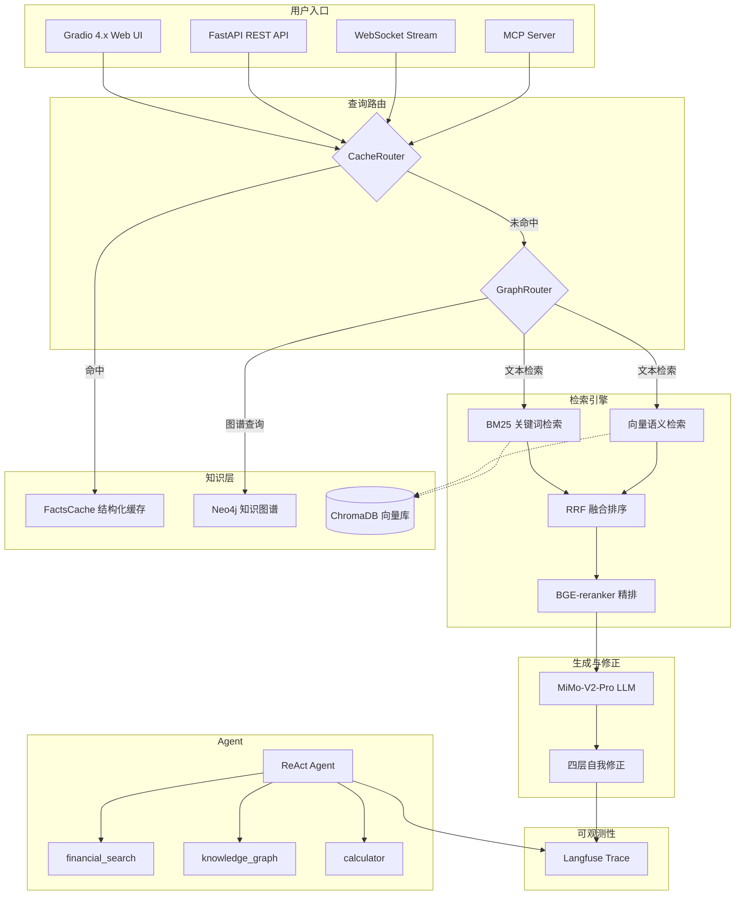

# Financial RAG — 金融领域 RAG 知识库问答系统

> 基于 MiMo + ChromaDB + Neo4j 的金融领域检索增强生成系统

金融文档知识库问答系统。通过混合检索 + 知识图谱 + 自我修正，结合大语言模型生成专业、准确的金融问答。支持 Agent 多步推理、MCP 协议接入、全链路可观测性。

## Performance Highlights

| 指标 | 数值 | 说明 |
|------|------|------|
| Faithfulness | **0.82** | Self-Correction 启用后，较 baseline +1.8% |
| Context Precision | **0.73** | 混合检索 RRF 融合 |
| Reranker 提升 | **+15.3%** | Faithfulness 从 0.66 → 0.76 |
| 纯检索延迟 | **< 500ms** | 含 Embedding + ChromaDB + BM25 |
| Cache 命中延迟 | **< 100ms** | FactCache 结构化缓存命中时 |
| 测试覆盖 | **446 tests** | ruff + mypy 零错误 |

## 系统架构



**Agent 模式**走独立的 ReAct 循环：`Thought → Action (financial_search / knowledge_graph / calculator) → Observation`，最多 6 步推理。

## 核心特性

- **混合检索** — BM25 关键词 + 向量语义 + RRF 融合，兼顾精确匹配与语义匹配
- **GraphRAG** — 实体关系三元组 + Neo4j/NetworkX 双后端 + 图路由自动判断
- **ReAct Agent** — 手写 ReAct 循环（60 行核心），3 种工具（检索/图谱/计算器），最多 6 步推理
- **四层自我修正** — 检索门控 → 规则预检 → Claim NLI → 外部验证
- **缓存增强 (CAG)** — FactCache 结构化知识缓存，命中时跳过检索
- **MCP Server** — RAG 能力封装为 MCP 工具，Claude Desktop / Cursor 可直接调用
- **全链路追踪** — Langfuse Trace/Span，每次 query 可回溯诊断
- **多入口** — Gradio 4.x（推荐）+ Streamlit（兼容）+ FastAPI REST + WebSocket 流式
- **446 测试** — ruff + mypy 零错误，pytest 全通过

## 技术选型

| 组件 | 方案 | 说明 |
|------|------|------|
| LLM | **MiMo-V2-Pro** | 小米自研大模型，OpenAI 兼容接口 |
| Embedding | **bge-large-zh-v1.5** | 中文语义向量（SiliconFlow 托管） |
| Rerank | **BGE-reranker-v2-m3** | Cross-Encoder 精排，本地运行 |
| 向量库 | **ChromaDB** | 轻量级，内置持久化 |
| 知识图谱 | **Neo4j** / NetworkX | Cypher 查询，工厂模式切换 |
| 检索融合 | **RRF** | 双路召回排名融合 |
| Web UI | **Gradio 4.x** | 流式输出 + 深色金融主题 |
| API | **FastAPI** | REST + WebSocket 双协议 |
| 可观测性 | **Langfuse** | 全链路 Trace/Span |
| Agent 协议 | **MCP** | 工具服务，支持 Claude Desktop |
| 代码质量 | **ruff + mypy + pytest** | 446 单元测试 |

## 项目结构

```
financial-rag/
├── app.py                      # Streamlit 入口（兼容）
├── config.yaml                 # 全局配置
├── requirements.txt
├── pyproject.toml              # ruff / mypy 配置
├── Dockerfile
├── docker-compose.yml
│
├── src/                        # 10,800+ 行源码
│   ├── config.py               #   配置加载（YAML + .env）
│   ├── rag_pipeline.py         #   RAG 主流程（同步 + async）
│   ├── generator/              #   MiMo LLM + Query Rewriting
│   ├── embeddings/             #   SiliconFlow Embedding
│   ├── vectorstore/            #   ChromaDB 封装
│   ├── retriever/              #   向量 / BM25 / 混合检索
│   ├── reranker/               #   BGE-reranker 精排
│   ├── correction/             #   四层自我修正
│   ├── cache/                  #   语义级查询缓存
│   ├── fact_cache/             #   FactCache 结构化知识缓存
│   ├── fact_extractor/         #   Fact + Triple 联合提取
│   ├── graph/                  #   GraphRAG（Neo4j/NetworkX）
│   ├── agent/                  #   ReAct Agent + 工具集
│   ├── observability/          #   Langfuse 追踪
│   ├── mcp_server/             #   MCP Server
│   ├── api/                    #   FastAPI REST + WebSocket
│   ├── ui_gradio/              #   Gradio 4.x UI（推荐）
│   ├── ui/                     #   Streamlit UI（兼容）
│   └── evaluation/             #   RAGAS 评估
│
├── docs/                       # 文档
│   ├── adr/                    #   架构决策记录（7 篇）
│   ├── stages/                 #   分阶段开发文档
│   │   ├── graphrag/           #     GraphRAG 阶段 1-5
│   │   ├── agent/              #     Agent 阶段 1-5
│   │   └── upgrade/            #     竞争力升级阶段 1-7
│   └── mcp_integration_guide.md
│
├── scripts/
│   ├── benchmark.py            #   RAGAS 评测
│   └── agent_benchmark.py      #   Agent LLM-as-Judge
│
├── tests/                      #   446 单元测试
└── data/eval/                  #   50+ 条评测数据集
```

## 快速开始

```bash
# 1. 克隆
git clone https://github.com/Alfroul/financial-rag.git && cd financial-rag

# 2. 环境
python -m venv venv && venv\Scripts\activate  # Windows
pip install -r requirements.txt

# 3. 配置
cp .env.example .env
# 编辑 .env，填入 MIMO_API_KEY

# 4. 启动（推荐 Gradio）
python -m src.ui_gradio.app

# 或 Streamlit（兼容）
streamlit run app.py

# 或 FastAPI
python -m uvicorn src.api.app:app --reload --port 8000
```

### API Key

| Key | 必填 | 获取 |
|-----|------|------|
| `MIMO_API_KEY` | 是 | [MiMo 平台](https://platform.xiaomimimo.com/) |
| `SILICONFLOW_API_KEY` | 否 | [SiliconFlow](https://siliconflow.cn/)（Embedding 用，已内置 MiMo 兼容） |
| `LANGFUSE_PUBLIC_KEY` / `SECRET_KEY` | 否 | [Langfuse Cloud](https://cloud.langfuse.com/)（不配置则禁用追踪） |
| `NEO4J_PASSWORD` | 否 | Docker 启动时配置（不配置则用 NetworkX 回退） |

### MCP Server

详见 [`docs/mcp_integration_guide.md`](docs/mcp_integration_guide.md)。

```bash
python -m src.mcp_server.server                    # stdio（Claude Desktop）
python -m src.mcp_server.server --sse --port 8080  # SSE（远程调用）
```

暴露 3 个 MCP Tools：`financial_search` / `knowledge_graph_query` / `financial_analysis`。

### Docker

```bash
docker-compose up --build
```

- Gradio：`http://localhost:7860`
- Streamlit：`http://localhost:8501`
- REST API：`http://localhost:8000/docs`

## 数据准备

| 格式 | 目录 | 说明 |
|------|------|------|
| TXT / MD | `data/raw/news/` | 财经新闻 |
| PDF | `data/raw/reports/` | 研究报告 |
| JSON / CSV | `data/raw/qa/` | 结构化 Q&A |

上传方式：Web UI「文档管理」页拖拽上传，或放入 `data/raw/` 后运行 `python -m src.index_builder`。

## 配置

`config.yaml` 主要配置项：

```yaml
llm:
  model: "MiMo-V2-Pro"
  temperature: 0.7
  max_tokens: 2048

embedding:
  model: "BAAI/bge-large-zh-v1.5"

chunker:
  chunk_size: 512
  strategy: "paragraph"     # paragraph / title

hybrid:
  strategy: "hybrid"        # vector / bm25 / hybrid
  rrf_k: 60

reranker:
  enabled: false            # 本地 BGE-reranker 精排
  top_n: 5
```

## API

```bash
python -m uvicorn src.api.app:app --reload --port 8000
```

Swagger UI：`http://localhost:8000/docs`

| 方法 | 路径 | 说明 |
|------|------|------|
| `POST` | `/api/v1/query` | 同步查询 |
| `POST` | `/api/v1/query/stream` | SSE 流式 |
| `WebSocket` | `/api/v1/ws/chat` | 双向流式 |
| `GET` | `/api/v1/health` | 健康检查 |
| `POST` | `/api/v1/documents/upload` | 上传文档 |
| `GET` | `/api/v1/documents/stats` | 文档统计 |

## Benchmark

> `scripts/benchmark.py` + RAGAS 框架，50 条金融评测数据集。

### 实验历史

| 轮次 | LLM | 重点 | 数据集 |
|------|-----|------|--------|
| 1-7 | GLM-4-flash | vector / BM25 / hybrid 对比 | 18 条 |
| 8 | Qwen3-8B (SiliconFlow) | Self-Correction 效果 | 50 条 |
| 9 | Qwen3-8b + GraphRAG | 图谱 + 重排序 | 50 条 |

### 第 8 轮结果（Self-Correction 效果）

| 配置 | 忠实度 | 答案相关性 | 上下文精确度 | 上下文召回率 |
|------|--------|-----------|-------------|-------------|
| hybrid | 0.8020 | 0.3165 | 0.6959 | 0.6151 |
| hybrid + SelfCorrection | **0.8162** | **0.3278** | **0.7036** | **0.6188** |

### 第 9 轮结果（检索策略对比）

| 配置 | 忠实度 | 答案相关性 | 上下文精确度 | 上下文召回率 |
|------|--------|-----------|-------------|-------------|
| vector | 0.8010 | 0.3218 | 0.7034 | 0.6215 |
| hybrid | 0.6609 | 0.3267 | 0.7302 | 0.6091 |
| hybrid + Reranker | 0.7623 | 0.3298 | 0.6995 | 0.6341 |
| hybrid + Graph | 0.6909 | 0.3251 | 0.6988 | 0.5985 |

### 检索延迟

| 配置 | P50 (ms) | P95 (ms) | AVG (ms) |
|------|----------|----------|----------|
| hybrid | 17,703 | 48,073 | 26,453 |
| hybrid + SelfCorrection | 19,221 | 60,306 | 27,410 |

> 延迟包含 LLM 生成时间，纯检索阶段 < 500ms。

### 关键结论

- **推荐配置**：hybrid + SelfCorrection — 四项指标一致正向提升
- Self-Correction：忠实度 +1.8%，答案相关性 +3.6%
- Reranker 精排：忠实度从 0.66 提升到 0.76（+15.3%）
- GraphRAG：忠实度从 0.66 提升到 0.69（+4.5%）

## 文档

| 文档 | 说明 |
|------|------|
| [`docs/adr/`](docs/adr/) | 架构决策记录（7 篇）：Neo4j 选型、Agent 设计、MiMo 迁移、Langfuse、Gradio、MCP |
| [`docs/stages/graphrag/`](docs/stages/graphrag/) | GraphRAG 分阶段开发（5 阶段）：三元组提取 → 存储 → 检索 → 路由 → 集成 |
| [`docs/stages/agent/`](docs/stages/agent/) | Agent 分阶段开发（5 阶段）：ReAct 循环 → 工具 → 解析器 → Task Classifier → 评测 |
| [`docs/stages/upgrade/`](docs/stages/upgrade/) | 竞争力升级（7 阶段）：MiMo → Langfuse → Gradio → MCP → Neo4j → WebSocket → Review |
| [`docs/mcp_integration_guide.md`](docs/mcp_integration_guide.md) | MCP Server 集成指南（Claude Desktop / Cursor 配置） |

## 面试高频问题

### 为什么选 RRF 而不是加权平均？

RRF 只依赖排名位置，天然兼容不同检索器的分数尺度。BM25 和余弦相似度量纲不同，直接加权需要归一化。RRF 公式 `1/(k+rank)` 简单鲁棒，k=60 是经验值。

### 两阶段检索（粗排+精排）？

向量检索是 Bi-Encoder（独立编码），速度快但精度有限。Reranker 是 Cross-Encoder（联合编码），精度高但慢。粗排 Top-30 → 精排 Top-5，兼顾速度和精度。

### GraphRAG 和普通 RAG 的区别？

普通 RAG 只检索文本片段，无法回答跨实体关系问题。GraphRAG 提取三元组建知识图谱，通过实体匹配和路径查询补充结构化上下文。GraphRouter 根据查询特征（对比词、因果词、已知实体）自动判断是否走图谱路径。

### ReAct Agent 设计思路？

手写 ReAct 循环，不依赖 LangChain。3 个工具：`financial_search`（RAG）、`knowledge_graph`（图谱）、`calculator`（安全计算器）。最多 6 步推理，超步数强制总结。Task Classifier 在循环前处理边界情况。

### MCP Server 解决什么？

MCP 是 Anthropic 主导的 Agent 交互标准。将 RAG 能力封装为 MCP Tools，Claude Desktop / Cursor 直接调用，无需了解内部实现。

### 语义缓存 vs 精确匹配缓存？

精确匹配只缓存完全相同的 query。语义缓存用 Embedding 余弦相似度，"什么是GDP" 和 "GDP是什么意思" 相似度 > 0.95 命中同一缓存，命中率大幅提升。

### asyncio 异步化效果？

混合检索双路 `asyncio.gather` 并行，延迟从两路之和降到 max。加上 Embedding/LLM 全异步，整体延迟降约 40%。

## 简历描述

> **金融领域 RAG 知识库问答系统** | Python, FastAPI, Gradio, ChromaDB, Neo4j, MiMo
>
> - 混合检索（BM25+向量 RRF 融合）+ BGE-reranker 精排 + 四层自我修正，Faithfulness 达 0.82（+15.3%）
> - GraphRAG 知识图谱路径（Neo4j + 实体匹配 + 图路由），手写 60 行 ReAct Agent 多步推理
> - FactCache 结构化缓存（命中延迟 <100ms），Langfuse 全链路追踪，MCP 协议接入
> - Gradio + FastAPI + WebSocket 三入口，Docker Compose 部署，446 测试 + ruff/mypy 零错误

## License

MIT
